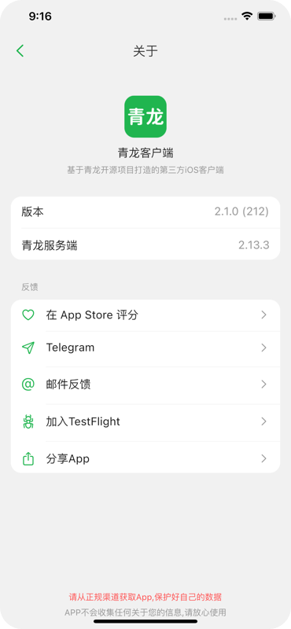
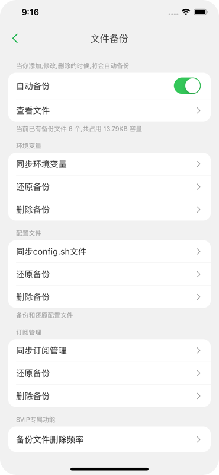
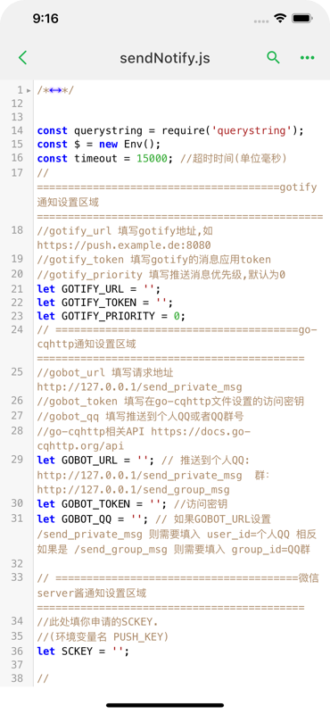
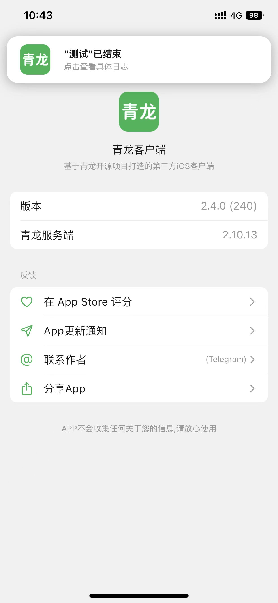

# qinglong_app

AppStore搜索 『青龙客户端』

版本更新通知 https://t.me/qinglongapp

基于[qinglong](https://github.com/whyour/qinglong)API实现的三方客户端,采用Flutter编写 (API最低支持2.10.0)

Android端下载地址:[Release](https://github.com/qinglong-app/qinglong_app/releases)

iOS端下载地址: [AppStore](https://apps.apple.com/cn/app/id1625871665)

不再开放源码, 之前的源码在这 https://github.com/qinglong-app/qinglong_app/tags

  
  
  

  
   
   

