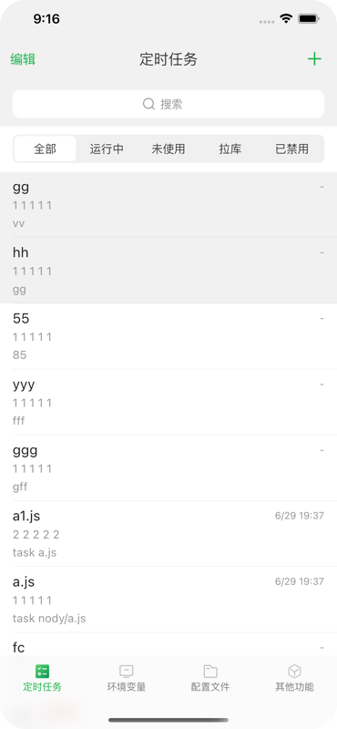

# qinglong_app

版本更新通知 https://t.me/qinglongapp

基于[qinglong](https://github.com/whyour/qinglong)API实现的三方客户端,采用Flutter编写 (API最低支持2.10.0)

Android端下载地址:[Release](https://github.com/qinglong-app/qinglong_app/releases)

iOS端下载地址: [AppStore](https://apps.apple.com/cn/app/id1625871665)

  
  
  

  
   

用于生成app的图标

>* flutter pub run flutter_launcher_icons:main

生成原生的启动页面

>* flutter pub run flutter_native_splash:create

修改app名称

>* flutter pub run flutter_app_name

生成json.jc.dart文件

>* flutter pub run build_runner build --delete-conflicting-outputs

